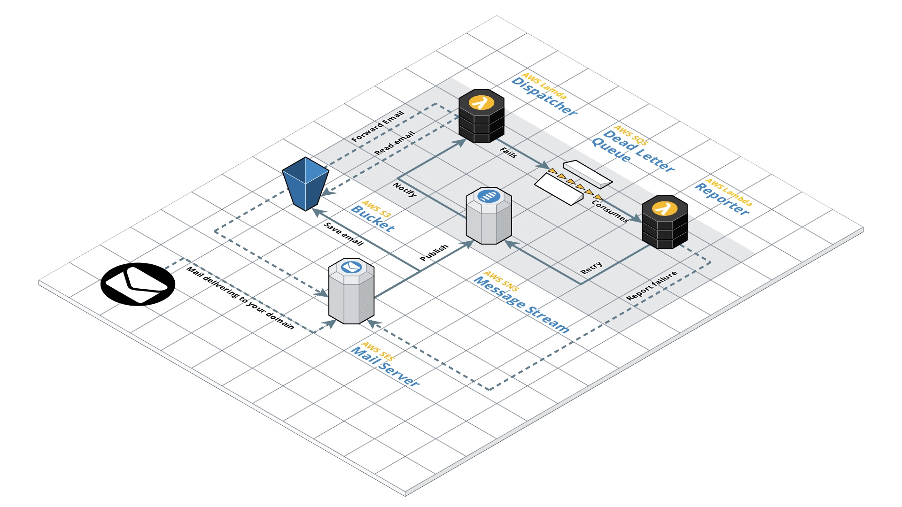

# maildog

> 🦴 Hosting your own email forwarding service on AWS\
> 🐶 Managing with Github actions\
> 🩺 Monitoring and failure recovery included\
> 🍖 Almost free\*

## 👋 Hey, why building this?

Since I bought my first domain, I am always tempted to use it as my email address.
However, as I am not receiving many emails a day, hosting my mail server or paying for an email hosting service either make it too complicated or costs too much.
All I want is simply a service forwarding emails to one single place.

I have been happily using [mailgun](https://www.mailgun.com) for years.
As they changed pricing last year, I started looking for a replacement but options are relatively limited.

After all, I open-sourced maildog and is looking for a community that shares the same needs as me.
The project aims to offer an extensible email forwarding solution with minimal maintenance and operational cost.

## ☁️ How it works?

## 💸 Pricing

Yes. While it is **FREE** to use maildog, you are still required to pay AWS for the infrastructure setup on the cloud.
To give you a better idea, here is an **estimated** price breakdown based on the following assumption:

- 10k emails / month or 333 emails / day
- 100KB mail size in average
- Hosted in US West (Oregon), pricing may be slightly different based on the region
- Counted without any [free quota](https://aws.amazon.com/free)

| Component   | Service             | Configuration summary                                                                                                                                                | Monthly   | Currency |
| ----------- | ------------------- | -------------------------------------------------------------------------------------------------------------------------------------------------------------------- | --------- | -------- |
| Bucket      | S3 Standard         | S3 Standard storage (1 GB per month, depends on the retention policy)                                                                                                | 0.080     | USD      |
| Mail Server | SES                 | Email messages received (10000), Average size of email received (100KB), Email messages sent from email client (10000), Data sent from email client (1 GB per month) | 2.120     | USD      |
| Mail Feed   | Standard SNS topics | DT Inbound: Not selected (0 TB per month), DT Outbound: Not selected (0 TB per month), AWS Lambda (10000 per month), Requests (10000 per month)                      | 0.010     | USD      |
| Dispatcher  | AWS Lambda          | Number of requests (10000, with no retry attempt)                                                                                                                    | 0.100     | USD      |
| Scheduler   | AWS Lambda          | Number of requests (< 10000)                                                                                                                                         | 0.100     | USD      |
| DLQ         | SQS                 | Standard queue requests (< 10000 per month)                                                                                                                          | 0.004     | USD      |
|             |                     |                                                                                                                                                                      | **2.434** | USD      |

> As of 30 June 2021, estimated using [AWS Pricing Calculator](https://calculator.aws/#/estimate?id=f5b7c2a46317a99bfb149569d601e7e285504b4c)
