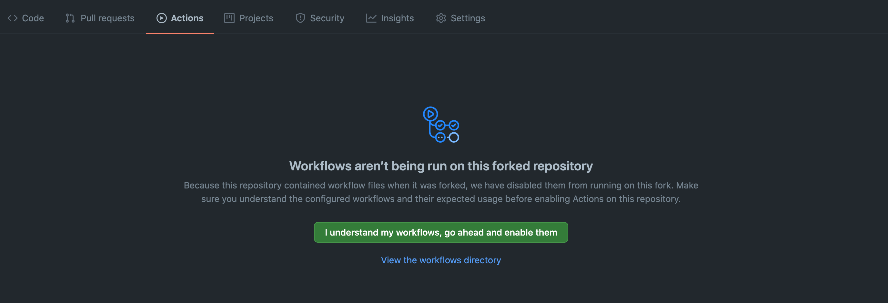

# Installation Guide

Before start, please make sure you understand the [potential cost](../README.md#-pricing) and the [limitations](../README.md#-limitations).

## 1. Preparation

### 1.1 Decide on one AWS region

As mentioned in the limitations section, there are only 3 regions that support email receiving at the moment.

1. `us-east-1` US East (N. Virginia)
2. `us-west-2` US West (Oregon)
3. `eu-west-1` Europe (Ireland)

Please choose one based on your preference. You will need the corresponding region code whenever you see `[YOUR REGION HERE]`

### 1.2 Setup aws-cli v2

By following the instructions on [AWS](https://docs.aws.amazon.com/cli/latest/userguide/install-cliv2.html), you will need to create a user on AWS IAM with **AdministratorAccess** (or permissions that covers all aws-cli usage below) and configure the credential using the following command:

```sh
aws configure

# AWS Access Key ID [None]: .....
# AWS Secret Access Key [None]: .....
# Default region name [None]: .....
# Default output format [None]: .....
```

### 1.3 Setup Github CLI

Similar to the previous step, just follow the instructions on [Github](https://github.com/cli/cli#installation). Be sure to [authenticate yourself](https://cli.github.com/manual/gh_auth_login) by:

```sh
# start interactive setup
gh auth login
```

## 2. Setting it up

### 2.1 Fork

To begin, please fork the repository and clone it locally.

```sh
# Fork and clone it at the same time
gh repo fork edmundhung/maildog --clone
```

```sh
# From now on, all commands provided assumes the root of the project being your working directory
cd maildog
```

```sh
# Create production branch from main branch [default branch]
# All your changes below should be pushed to the production branch
# The deploy workflow will automatically deploy changes pushed to this branch
git checkout -b production
```

### 2.2 Configure `maildog` with `maildog.config.json`

A JSON file with the name `maildog.config.json` is required at the root of the project.
The format as follows:

<!-- prettier-ignore -->
```jsonc
// This config file support json with comment (jsonc)
// It simply adds support to single line (//) and multi-line comments (/* ... */) on `json` document
{
  "domains": {
    "exmaple.com": {                    // your domain here
      "fromEmail": "foo",               // optional, default: "noreply"
      "scanEnabled": false,             // optional, default: true,
      "tlsEnforced": false,             // optional, default: false,
      "fallbackEmails": [],             // optional, default: []
      "alias": {                        // required if `fallbackEmails` are not set
        "bar": {                        // result in `bar@exmaple.com`
          "description": "Lorem ipsum", // optional, default: ""
          "to": ["baz@exmaple.com"]     // required
        }
      }
    }
  }
}
```

- **fromEmail**: The sender email address used when `maildog` forward the email
- **scanEnabled**: If true, then emails received will be scanned for spam and viruses
- **tlsEnforced**: Specifies whether `maildog` should require that incoming email is delivered over a connection encrypted with Transport Layer Security (TLS).
- **fallbackEmails**: A catch-all / wildcard rule. All emails received on the corresponding domain will be forwarded to these email addresses unless specified in the `alias` section.
- **alias**: The email prefix with a `description` and list of email addresses forwarding `to`

Here is an [example](../examples/maildog.config.json) config.

### 2.3. Verify your domain and email address on AWS SES

In this step, you might prefer verifying your domain through the AWS console UI as it will guide you through the DNS records that need to be created. But if you are familiar with a DNS zone file, you can generate one using the command below:

```sh
DOMAIN=[YOUR DOMAIN HERE];
REGION=[YOUR REGION HERE];
sed \
-e "s|\${Domain}|$DOMAIN|g" \
-e "s|\${Region}|$REGION|g" \
-e "s|\${VerificationToken}|$(aws ses verify-domain-identity --domain "$DOMAIN" --output text)|g" \
-e "s|\${DkimToken\[0\]}|$(aws ses verify-domain-dkim --domain "$DOMAIN" --query DkimTokens[0] --output text)|g" \
-e "s|\${DkimToken\[1\]}|$(aws ses verify-domain-dkim --domain "$DOMAIN" --query DkimTokens[1] --output text)|g" \
-e "s|\${DkimToken\[2\]}|$(aws ses verify-domain-dkim --domain "$DOMAIN" --query DkimTokens[2] --output text)|g" \
./examples/maildog.zonefile.txt
```

If you are new to AWS SES and you are setting up with the sandbox. You **MUST** verify the email address that you are forwarding to with AWS using the following command:

```sh
aws ses verify-email-identity --email-address [YOUR EMAIL HERE]
```

### 2.4 Setup secrets

To let Github managing `maildog` for you, there are 4 secrets that need to be set.

#### 2.4.1 AWS_ACCESS_KEY_ID / AWS_SECRET_ACCESS_KEY

To deploy maildog, we need to set up an IAM user with **Programmatic access**.
We have prepared an [example](maildog-policy.json) JSON policy for your reference.
You can also create the user and set the corresponding secrets using the command below:

```sh
# Create IAM User - `maildog-user`
aws iam create-user --user-name maildog-user
```

```sh
# Create IAM Policy - `maildog-policy`
aws iam create-policy --policy-name maildog-policy --policy-document file://docs/maildog-policy.json
```

```sh
# Attach policy `maildog-policy` to user `maildog-user`
aws iam attach-user-policy --user-name maildog-user --policy-arn $(aws iam list-policies --query "Policies[?PolicyName=='maildog-policy'].Arn" --output text)
```

```sh
# Generate Sign-in credentials for user user `maildog-user`
# Set AccessKeyId and SecretAccessKey as secret
aws iam create-access-key --user-name maildog-user --query "AccessKey.[AccessKeyId,SecretAccessKey]" --output text \
| tee >(awk '{print $1;}' | gh secret set AWS_ACCESS_KEY_ID) >(awk '{print $2;}' | gh secret set AWS_SECRET_ACCESS_KEY)

```

#### 2.4.2 AWS_REGION

You must also provide the region code as a secret for Github to deploy `maildog` to your preferred region:

```sh
# Set AWS region as secret
gh secret set AWS_REGION -b"[YOUR REGION HERE]"
```

#### 2.4.3 ENCRYPT_PASSPHRASE

In order to protect your config detail from the public, it should be encrypted before commit:

```sh
# Encrypt maildog.config.json with gpg
# You will be asked to enter a passphrase twice
# A file with the name  `maildog.config.json.gpg` will be created
npm run encrypt-config
```

```sh
# Commit the encrypted config
git add maildog.config.json.gpg && \
git commit -m "build: configure maildog"
```

```sh
# Set the passpharse as secret so the workflows can decrypt the config
gh secret set ENCRYPT_PASSPHRASE -b"[PASSPHARSE]"
```

## 3. Deploy maildog

### 3.1 Enable workflows on your forked repository



Before Github can manage maildog, you need to enable it explicitly.
Please visit the actions tab of your repository and enable it by clicking `I understand my workflows, go ahead and enable them`.

### 3.2 Run the Deploy workflow

Now, everything is ready. All you need is to push the production branch up with the changes you made previously.
The deploy workflow will be triggered automatically whenever you push to the `production` branch:

```sh
# Push the production branch
git push --set-upstream origin production
```

```sh
# Check the deploy workflow status
gh workflow view --web deploy.yaml
```

### 3.3 Destroy maildog

You can delete everything deployed easily with the destroy workflow:

```sh
# Check the destroy workflow from Github
gh workflow view --web destroy.yaml
```

### 3.4 Monitor with Health check

`maildog` sends failed messages to the Dead Letter Queue (DLQ). The health workflow works by monitoring the alarm status configured to the DLQ every hour. You can enable it if needed:

```sh
#Enable the health workflow
gh workflow enable health.yaml
```
